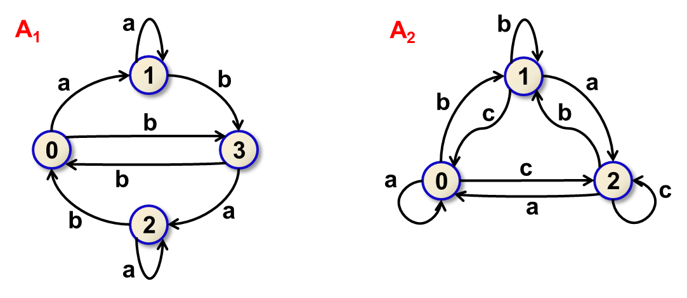

# Incomplete Automaton
You are given a deterministic finite automat, however, information on the initial and final states is missing. Instead of it, a set of words accepted by the automaton (called positive examples) and a set of words rejected by the automaton (called negative examples) are provided. For each final state q, the positive examples contain at least one word which translates the initial state to state q. The number of final states is also known. Your task is to determine which choices of the initial and final states are admissible with respect to the positive and negative examples.

**Input**
The first row consists of six integers S, A, F, P, N, L separated by a space. The values represent the number of states of the automaton (S), size of the input alphabet (A), the number of final states (F), the number of positive examples (P), the number of negative examples (N) and a (uniform) length of each example (L). States of the automaton are denoted by numbers 0,..,S−1. The input alphabet consists of the first A characters from the range 'a',..,'z'. It holds 2≤A≤26 and 1≤F≤S. The first row is followed by S lines defining the transition function. Each line contains A+1 integers separated by a space. The first number is a state q for which the line defines all transitions: the i+1-st number is the state which the automaton enters from q after reading the i-th character of the input alphabet. All this is followed by P lines with positive examples, immediately followed by N lines with negative examples. Each of the examples is a word of length L.

It is known that all the examples were generated using the following algorithm. Choose at most log L indices from the range 1,..,L-√L. At these positions, generate character 'a' or 'b', each of them with probability 1/2. Set the other characters of the prefix of length L-√L to 'a'. Generate randomly the remaining characters of the suffix of length √L. In this case, each character is generated from the whole input alphabet, with the uniform distribution.

Value of S does not exceed 300, value of F does not exceed 30, value of P does not exceed 2000, value of N does not exceed 5000 and value of L does not exceed 30000.

**Output**
The output is formed of several lines. Each line represents one possible choice of the initial and final states: there are F+1 numbers, separated by a space. The first value is the initial state. The next F values are final states arranged in ascending order. All the output lines are arranged lexicographically in ascending order as integer vectors of dimension F+1. Each possible solution is contained in the output exactly once.

**Example** 1
Input
4 2 2 2 2 9
0 1 3
1 1 3
2 2 0
3 2 0
aaaaaaaba
abaaaabbb
aaaaaabbb
aaaaabbaa
Output
0 0 2
1 0 2
2 1 3
3 1 3
The automaton represented by the input is depicted as A1 in Figure 1. If state 0 is chosen as the initial one, the automaton finishes in state 2 when reading the first positive example, in state 0 when reading the second positive example, in state 3 when reading the first negative example and in state 1 when reading the second negative example. It is thus necessary to choose 0 and 2 as the final states. Since F=2, there are no other final states. This solution is represented by the first line of the output.
